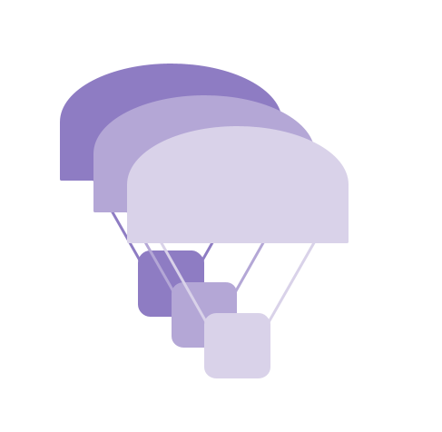

# parachute

<p align="center"></p>

[](https://github.com/briancairl/parachute/actions/workflows/pr.yml)

## Description

Parallelism utility library featuring:

- a customizable thread pool implementation
- deferred execution abstractions

## API Documentation

Documentation for the latest version available [here](https://briancairl.github.io/parachute/doxygen-out/html/index.html)

## Requirements

- `cmake >= 3.5`
- `c++17`

## Running tests

### Clean rebuild and test

```bash
rm -rf build; (mkdir build && cd build && cmake .. -DPARA_ENABLE_TESTING:bool=on && make && ctest -V); cd ..
```
